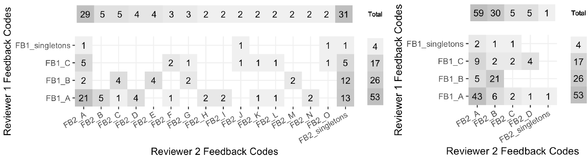

```{r setup, include=FALSE}
knitr::opts_chunk$set(echo = FALSE)

library(tidyverse)
library(kableExtra)

```

# Whova Poll (e acesso à página de recursos)

*Como você descreveria o valor da avaliação formativa?*

- Resposta construída (texto livre de resposta curta)
- Resposta selecionada (múltipla escolha; selecione todas que se aplicam)

\vskip 18pt


##### Digitalize com o celular para acessar a página de recursos:

{width=25%}


# Motivação

- Tarefas "escrever para aprender" melhoram os resultados de aprendizagem (Graham, et al., 2020)
- Crítico para os cidadãos-estatísticos comunicarem ideias estatísticas de forma eficaz (Gould, 2010)
- A prática contínua de comunicação melhora a alfabetização estatística e promove a retenção (Basu, et al., 2013)
- A avaliação formativa beneficia alunos e instrutores (GAISE, 2016; Pearl, et al., 2012)
- *Logística* de tarefas de resposta construídas prejudicam o uso em turmas de grande matrícula


# Estado da meta

*Feedback de avaliação formativa assistida por computador para tarefas de resposta curta em turmas de grande número de matrículas, de modo que a carga do instrutor seja semelhante à da turma pequena (~ 30 alunos)*


- A colaboração homem-máquina é um mecanismo promissor para auxiliar o feedback rápido e individualizado em escala (Basu, 2013)
- Processamento de linguagem natural (NLP) envolve como os computadores podem ser programados para analisar elementos de linguagem (por exemplo, texto ou fala)
- O feedback assistido pela PNL foi estudado anteriormente para ensaios ou tarefas de resposta longa (ver, por exemplo, Attali, et al., 2008; Page, 1994)


# Questões de pesquisa

- **RQ1**: Que nível de concordância é alcançado entre os avaliadores humanos treinados rotulando (ou seja, pontuando ou marcando) tarefas de resposta curta?

- **RQ2**: Que nível de concordância é alcançado entre avaliadores humanos e um algoritmo de PNL?

- **RQ3**: Que tipo de representação PNL leva a um bom desempenho de clustering e como isso interage com o algoritmo de classificação?

\vskip 18pt

### Manuscrito

\footnotesize

Susan Lloyd, Matthew Beckman, Dennis Pearl, Rebecca Passonneau, Zhaohui Li, & Zekun Wang (accepted). Foundations of NLP-assisted formative assessment feedback for short-answer tasks in large enrollment statistics classes. Preprint URL: <http://arxiv.org/abs/2205.02829>


# Spoiler?!

- **RQ1**: Que nível de concordância é alcançado entre os avaliadores humanos treinados que rotulam (ou seja, pontuam) tarefas de resposta curta?

- **RQ2**: Que nível de concordância é alcançado entre avaliadores humanos e um algoritmo de PNL?

- **RQ3**: Que tipo de representação NLP leva a um bom desempenho de clustering e como isso interage com o algoritmo de classificação?

### *Spoilers?!*
- RQ1: acordo substancial entre avaliadores e intraavaliadores
- RQ2: concordância substancial entre rotulagem humana e PNL
- RQ3: em andamento, mas promissor


# Métodos (amostra)

O estudo utilizou dados existentes desidentificados e rubricas de pontuação (Beckman, 2015)

- 6 tarefas de resposta curta
- 1.935 alunos no total
- 29 turmas de 15 instituições distintas

# Métodos (tarefa de resposta curta)


{width=90%}


# Métodos (RQ1)

- 3 avaliadores humanos típicos da equipe de instrução de grande número de matrículas
- 63 respostas dos alunos em comum para cada *combinação* de avaliadores para quantificar a concordância (por exemplo, par a par, consenso, etc.)
- restrição: dados suficientes para análise intra-avaliador para pessoa que marcou 178 respostas 6 anos antes


# Métodos (RQ2)

O conjunto de respostas à tarefa foi dividido aleatoriamente de quatro maneiras:

- 90% dos dados para fins de desenvolvimento, foram particionados de acordo com as melhores práticas de aprendizado de máquina:
    - treinamento (72%),
    - desenvolvimento (9%)
    - avaliação (9%)
- 10% dos dados mantidos em reserva para testes mais rigorosos

\vskip 14pt

Dois algoritmos de PNL foram comparados quanto à precisão usando um subconjunto de respostas dos alunos (Li et al., 2021).

- LSTM: uma regressão logística combinada com uma Long Short-Term Memory para aprender representações vetoriais
- SFRN: Rede de relação de transformação semântica baseada em recursos


# Métodos (RQ3)

Piloto manual de clustering gerado por humanos

- Dois revisores avaliaram independentemente 100 respostas de alunos que ganharam "crédito parcial" em tarefas de inferência
- Cada revisor forneceu feedback de texto livre para cada aluno
- Feedback literal capturado para cada revisor e tabulado para análise.


# Resultados (RQ1)

**RQ1**: Que nível de concordância é alcançado entre avaliadores humanos treinados que rotulam (ou seja, pontuam) tarefas de resposta curta?

| Comparação | Confiabilidade |
|:---------------|------------:|
| Avaliador A e Avaliador C | QWK = 0,83 |
| Avaliador A e Avaliador D | QWK = 0,80 |
| Avaliador C & Avaliador D | QWK = 0,79 |
| Avaliador A: 2015 e 2021 | QWK = 0,88 |
| Avaliadores A, C e D | FK = 0,70 |


\footnotesize

Interpretação de confiabilidade[^1]: 0,6 < substancial < 0,8 < quase perfeito < 1,0

[^1]: Viera & Garrett (2005)


# Resultados (RQ2)

**RQ2**: Que nível de concordância é alcançado entre avaliadores humanos e a máquina (um algoritmo de PNL)?

O algoritmo SFRN alcançou uma precisão de classificação muito maior do que o LSTM (83% vs. 72%)[^2]. Acordo Humano e SFRN:

| Comparação | Confiabilidade |
|:---------------|------------:|
| Avaliador A & SFRN | QWK = 0,79 |
| Avaliador C & SFRN | QWK = 0,82 |
| Avaliador D & SFRN | QWK = 0,74 |
| Avaliadores: A, C, D e SFRN | FK = 0,68 |


\footnotesize

Interpretação de confiabilidade[^3]: 0,6 < substancial < 0,8 < quase perfeito < 1,0

[^2]: a comparação SFRN e LSTM exclui instâncias em que os rótulos humanos discordam
[^3]: Viera & Garrett (2005)


# Resultados (máquinas RQ3)

**RQ3**: Que tipo de representação de NLP leva a um bom desempenho de clustering e como isso interage com o algoritmo de classificação?

- SFRN aprende uma representação vetorial de alta dimensão (D = 512) nos dados de treinamento.
- Experimentos com agrupamento K-means e K-medoids mostraram que o SFRN produz agrupamentos mais consistentes quando treinado novamente (0,62), em comparação com outros classificadores.[^4]
- Maior consistência (0,88; D = 50), no entanto, foi alcançada usando um método de fatoração de matrizes que produz representações estáticas (WTMF; Guo & Diab, 2011)

[^4]: A consistência é medida como a proporção de todos os pares de respostas em uma determinada classe por pergunta que são agrupadas da mesma maneira em duas execuções (no mesmo agrupamento ou não no mesmo agrupamento).

# Resultados (humanos RQ3)

{width=95%}

- O revisor 1 favoreceu o feedback sobre conceitos estatísticos (somente).
- O revisor 2 forneceu o mesmo, além de uma cotação do aluno
- O Revisor 2 analisou seu feedback para comparar suas observações relacionadas aos conceitos estatísticos (somente) com o feedback do Revisor 1.


# Discussão

- **RQ1**: A concordância substancial alcançada entre avaliadores humanos treinados fornece contexto para comparações adicionais

- **RQ2**: algoritmo de PNL produziu concordância razoavelmente alinhada aos resultados alcançados por pares/grupos de avaliadores humanos treinados

- **RQ3**: Classificação e agrupamento têm incentivos concorrentes para dimensionalidade; Low D é melhor para a estabilidade do cluster, High D é melhor para a confiabilidade da classificação.


# Trabalho futuro

- O estudo usa dados existentes de estudos anteriores coletados de muitas turmas de tamanhos variados
    - nem uma única classe grande
    - esperamos que os resultados observados sejam conservadores devido à variabilidade adicional entre instituições e instrutores, mas serão investigados mais detalhadamente
- "Maldição da dimensionalidade" no lado do aprendizado de máquina
- Desempenho de cluster versus significado semântico
    - o agrupamento é necessário, mas não suficiente, para o significado semântico
    - significado semântico de clusters de PNL ainda não estudados rigorosamente


# Referências (1/2)


\footnotesize

1. Attali, Y., Powers, D., Freedman, M., Harrison, M., & Obetz, S. (2008). Automated Scoring of Short-Answer Open-Ended Gre® Subject Test Items. *ETS Research Report Series, 2008*(1), i–22.

#. Basu, S., Jacobs, C., & Vanderwende, L. (2013). Powergrading: a Clustering Approach to Amplify Human Effort for Short Answer Grading. *Transactions of the Association for Computational Linguistics, 1*, 391–402. <https://doi.org/10.1162/tacl_a_00236>

#. Beckman, M. (2015). Assessment Of Cognitive Transfer Outcomes For Students Of Introductory Statistics. <http://conservancy.umn.edu/handle/11299/175709>

#. GAISE College Report ASA Revision Committee (2016). Guidelines for Assessment and Instruction in Statistics Education College Report 2016. URL: <http://www.amstat.org/education/gaise>

#. Gould, R. (2010). Statistics and the Modern Student. *International Statistical Review / Revue Internationale de Statistique, 78*(2), 297–315. <https://www.jstor.org/stable/27919839>

#. Guo, W., Diab, M. (2012) Modeling Sentences in the Latent Space. In *Proceedings of the 50th Annual Meeting of the Association for Computational Linguistics*, pages 864–872. Association for Computational Linguistics.


# Referências (2/2)

\footnotesize

7. Graham, S., Kiuhara, S. A., & MacKay, M. (2020). The Effects of Writing on Learning in Science, Social Studies, and Mathematics: A Meta-Analysis. *Review of Educational Research, 90*(2), 179–226. <https://doi.org/10.3102/0034654320914744>

#. Li, Z., Tomar, Y., & Passonneau, R. J. (2021). A Semantic Feature-Wise Transformation Relation Network for Automatic Short Answer Grading. In *Proceedings of the 2021 Conference on Empirical Methods in Natural Language Processing*, pp. 6030–6040. Association for Computational Linguistics. <https://aclanthology.org/2021.emnlp-main.487>

#. Page, E. B. (1994). Computer Grading of Student Prose, Using Modern Concepts and Software. *The Journal of Experimental Education, 62*(2), 127–142.

#. Pearl, D. K., Garfield, J. B., delMas, R., Groth, R. E., Kaplan, J. J., McGowan, H., & Lee, H. S. (2012). Connecting Research to Practice in a Culture of Assessment for Introductory College-level Statistics. URL: <http://www.causeweb.org/research/guidelines/ResearchReport_Dec_2012.pdf>

#. Viera, A. J., & Garrett, J. M. (2005). Understanding interobserver agreement: the kappa statistic. *Family Medicine, 37*(5), 360–363.


# Obrigada 


\titlepage


URL da página de recurso: <https://mdbeckman.github.io/ICSA2022/>

<!-- # Backup slide -->


