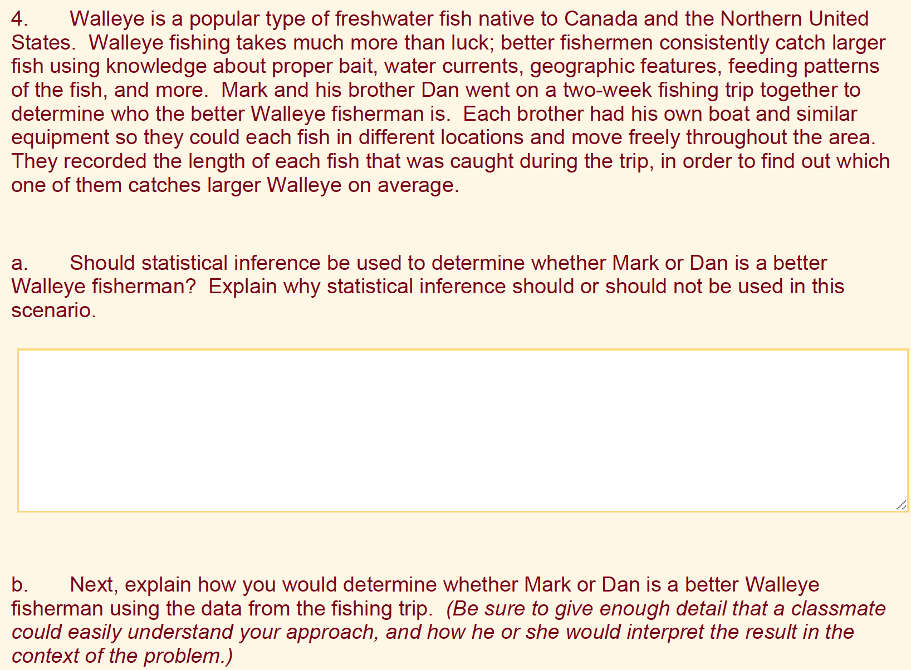

```{r setup, include=FALSE}
knitr::opts_chunk$set(echo = FALSE)

library(tidyverse)
library(kableExtra)

```

# Encuesta de Whova (página de recursos)

*¿Cómo describiría el valor de la evaluación formativa?*

- Respuesta construida (texto libre de respuesta corta)
- Respuesta seleccionada (opción múltiple; seleccione todas las que correspondan)

\vskip 18pt


##### Escanee con el teléfono móvil para acceder a la página de recursos:

{width=25%}


# Motivación

- Las tareas de "escribir para aprender" mejoran los resultados del aprendizaje (Graham, et al., 2020)
- Crítico para que los ciudadanos-estadísticos comuniquen ideas estadísticas de manera efectiva (Gould, 2010)
- La práctica continua con la comunicación mejora la alfabetización estadística y promueve la retención (Basu, et al., 2013)
- La evaluación formativa beneficia tanto a los estudiantes como a los instructores (GAISE, 2016; Pearl, et al., 2012)
- La *logística* de las tareas de respuesta construida pone en peligro el uso en clases de inscripción grande

# Estado del objetivo

*Retroalimentación de la evaluación formativa asistida por computadora para tareas de respuesta corta en clases de inscripción grande, de modo que la carga del instructor es similar a la clase pequeña (~30 estudiantes)*

- La colaboración hombre-máquina es un mecanismo prometedor para ayudar a la retroalimentación rápida e individualizada a escala (Basu, 2013)
- El procesamiento del lenguaje natural (PNL) implica cómo se pueden programar las computadoras para analizar elementos del lenguaje (por ejemplo, texto o voz)
- La retroalimentación asistida por PNL se ha estudiado previamente para ensayos o tareas de respuesta larga (ver, por ejemplo, Attali, et al., 2008; Page, 1994)


# Preguntas de investigación

- **RQ1**: ¿Qué nivel de acuerdo se logra entre evaluadores humanos capacitados al etiquetar (es decir, calificar o calificar) tareas de respuesta corta?

- **RQ2**: ¿Qué nivel de acuerdo se logra entre evaluadores humanos y un algoritmo de PNL?

- **RQ3**: ¿Qué tipo de representación de PNL conduce a un buen rendimiento de agrupación y cómo interactúa eso con el algoritmo de clasificación?

\vskip 18pt

### Manuscrito

\footnotesize

Susan Lloyd, Matthew Beckman, Dennis Pearl, Rebecca Passonneau, Zhaohui Li, & Zekun Wang (accepted). Foundations of NLP-assisted formative assessment feedback for short-answer tasks in large enrollment statistics classes. Preprint URL: <http://arxiv.org/abs/2205.02829>

# ¡¿Spoilers?!

- **RQ1**: ¿Qué nivel de acuerdo se logra entre evaluadores humanos capacitados al etiquetar (es decir, calificar) tareas de respuesta corta?

- **RQ2**: ¿Qué nivel de acuerdo se logra entre evaluadores humanos y un algoritmo de PNL?

- **RQ3**: ¿Qué tipo de representación de PNL conduce a un buen rendimiento de agrupación y cómo interactúa eso con el algoritmo de clasificación?

### *¡¿Spoilers?!*
- RQ1: acuerdo sustancial entre evaluadores e intraevaluadores
- RQ2: acuerdo sustancial entre el etiquetado humano y PNL
- RQ3: en progreso, pero prometedor

# Métodos (Muestra)

El estudio utilizó datos existentes no identificados y rúbricas de puntuación (Beckman, 2015)

- 6 tareas de respuesta corta
- 1.935 estudiantes en total
- 29 secciones de clase 15 instituciones distintas


# Métodos (tarea de respuesta corta)

{width=90%}


# Métodos (RQ1)

- 3 evaluadores humanos típicos del equipo de instrucción de inscripción grande
- 63 respuestas de estudiantes en común para cada *combinación* de evaluadores para cuantificar el acuerdo (por ejemplo, por pares, consenso, etc.)
- restricción: datos suficientes para el análisis intraevaluador para la persona que había etiquetado 178 respuestas 6 años antes

# Métodos (RQ2)

El conjunto de tareas-respuestas se dividió aleatoriamente en cuatro formas:

- El 90 % de los datos para fines de desarrollo se dividieron de acuerdo con las mejores prácticas de aprendizaje automático:
    - formación (72%),
    - desarrollo (9%)
    - evaluación (9%)
- 10% de los datos se mantienen en reserva para pruebas más rigurosas

\vskip 14pt

Se comparó la precisión de dos algoritmos de PNL utilizando un subconjunto de respuestas de estudiantes (Li et al., 2021).

- LSTM: una regresión logística combinada con una Memoria a Corto Plazo Largo para aprender representaciones vectoriales
- SFRN: Red de relación de transformación semántica basada en características


# Métodos (RQ3)

Piloto manual de agrupamiento generado por humanos

- Dos revisores evaluaron de forma independiente 100 respuestas de estudiantes que obtuvieron "crédito parcial" en tareas de inferencia
- Cada revisor proporcionó comentarios de texto libre a cada estudiante
- Comentarios textuales capturados para cada revisor y tabulados cruzados para su análisis.


# Resultados (RQ1)

**RQ1**: ¿Qué nivel de acuerdo se logra entre evaluadores humanos capacitados al etiquetar (es decir, calificar) tareas de respuesta corta?

| Comparación | Confiabilidad |
|:---------------|------------------:|
| Calificador A y Calificador C | QWK = 0,83 |
| Calificador A y Calificador D | QWK = 0,80 |
| Calificador C y Calificador D | QWK = 0,79 |
| Calificador A: 2015 y 2021 | QWK = 0,88 |
| Calificadores A, C y D | FC = 0,70 |


\footnotesize

Interpretación de confiabilidad[^1]: 0,6 < sustancial < 0,8 < casi perfecto < 1,0

[^ 1]: Viera y Garrett (2005)


# Resultados (RQ2)

**RQ2**: ¿Qué nivel de acuerdo se logra entre los evaluadores humanos y la máquina (un algoritmo de PNL)?

El algoritmo SFRN logró una precisión de clasificación mucho mayor que LSTM (83 % frente a 72 %)[^2]. Acuerdo humano y SFRN:

| Comparación | Confiabilidad |
|:---------------|------------------:|
| Calificador A y SFRN | QWK = 0,79 |
| Calificador C y SFRN | QWK = 0,82 |
| Calificador D y SFRN | QWK = 0,74 |
| Calificadores: A, C, D y SFRN | FC = 0,68 |


\footnotesize

Interpretación de confiabilidad[^3]: 0,6 < sustancial < 0,8 < casi perfecto < 1,0

[^2]: la comparación de SFRN y LSTM excluye instancias en las que las etiquetas humanas no están de acuerdo
[^3]: Viera y Garrett (2005)


# Resultados (RQ3 máquinas)

**RQ3**: ¿Qué tipo de representación de PNL conduce a un buen rendimiento de agrupación y cómo interactúa eso con el algoritmo de clasificación?

- SFRN aprende una representación vectorial de gran dimensión (D = 512) en los datos de entrenamiento.
- Los experimentos con el agrupamiento de K-means y K-medoids mostraron que SFRN produce agrupaciones más consistentes cuando se vuelve a entrenar (0,62), en comparación con otros clasificadores.[^4]
- La consistencia más alta (0.88; D = 50), sin embargo, se logró usando un método de factorización de matrices que produce representaciones estáticas (WTMF; Guo & Diab, 2011)

[^4]: la consistencia se mide como la proporción de todos los pares de respuestas en una clase determinada por pregunta que se agrupan de la misma manera en dos ejecuciones (en el mismo grupo o no en el mismo grupo).

# Resultados (RQ3 humanos)

{width=95%}

- El revisor 1 favoreció la retroalimentación sobre conceptos estadísticos (únicamente).
- El revisor 2 proporcionó lo mismo, más una cita del estudiante
- El Revisor 2 analizó sus comentarios para comparar sus comentarios relacionados con los conceptos estadísticos (solo) con los comentarios del Revisor 1.


# Discusión

- **RQ1**: El acuerdo sustancial logrado entre evaluadores humanos capacitados proporciona contexto para comparaciones adicionales

- **RQ2**: el algoritmo de PNL produjo un acuerdo razonablemente alineado con los resultados logrados por pares/grupos de evaluadores humanos capacitados

- **RQ3**: La clasificación y el agrupamiento tienen incentivos que compiten por la dimensionalidad; Low D es mejor para la estabilidad del grupo, High D es mejor para la confiabilidad de la clasificación.


### Trabajo futuro:

- El estudio utiliza datos existentes de estudios anteriores recopilados de muchas clases de diferentes tamaños
    - ni una sola clase grande
    - esperamos que los resultados observados sean conservadores debido a la variabilidad adicional entre instituciones e instructores, pero se investigarán más a fondo
- "Maldición de la dimensionalidad" en el lado del aprendizaje automático
- Rendimiento de agrupamiento frente a significado semántico
    - el agrupamiento es necesario, pero no suficiente, para el significado semántico
    - el significado semántico de los grupos de PNL aún no se ha estudiado rigurosamente


# Referencias (1/2)


\footnotesize

1. Attali, Y., Powers, D., Freedman, M., Harrison, M., & Obetz, S. (2008). Automated Scoring of Short-Answer Open-Ended Gre® Subject Test Items. *ETS Research Report Series, 2008*(1), i–22.

#. Basu, S., Jacobs, C., & Vanderwende, L. (2013). Powergrading: a Clustering Approach to Amplify Human Effort for Short Answer Grading. *Transactions of the Association for Computational Linguistics, 1*, 391–402. <https://doi.org/10.1162/tacl_a_00236>

#. Beckman, M. (2015). Assessment Of Cognitive Transfer Outcomes For Students Of Introductory Statistics. <http://conservancy.umn.edu/handle/11299/175709>

#. GAISE College Report ASA Revision Committee (2016). Guidelines for Assessment and Instruction in Statistics Education College Report 2016. URL: <http://www.amstat.org/education/gaise>

#. Gould, R. (2010). Statistics and the Modern Student. *International Statistical Review / Revue Internationale de Statistique, 78*(2), 297–315. <https://www.jstor.org/stable/27919839>

#. Guo, W., Diab, M. (2012) Modeling Sentences in the Latent Space. In *Proceedings of the 50th Annual Meeting of the Association for Computational Linguistics*, pages 864–872. Association for Computational Linguistics.


# Referencias (2/2)

\footnotesize

7. Graham, S., Kiuhara, S. A., & MacKay, M. (2020). The Effects of Writing on Learning in Science, Social Studies, and Mathematics: A Meta-Analysis. *Review of Educational Research, 90*(2), 179–226. <https://doi.org/10.3102/0034654320914744>

#. Li, Z., Tomar, Y., & Passonneau, R. J. (2021). A Semantic Feature-Wise Transformation Relation Network for Automatic Short Answer Grading. In *Proceedings of the 2021 Conference on Empirical Methods in Natural Language Processing*, pp. 6030–6040. Association for Computational Linguistics. <https://aclanthology.org/2021.emnlp-main.487>

#. Page, E. B. (1994). Computer Grading of Student Prose, Using Modern Concepts and Software. *The Journal of Experimental Education, 62*(2), 127–142.

#. Pearl, D. K., Garfield, J. B., delMas, R., Groth, R. E., Kaplan, J. J., McGowan, H., & Lee, H. S. (2012). Connecting Research to Practice in a Culture of Assessment for Introductory College-level Statistics. URL: <http://www.causeweb.org/research/guidelines/ResearchReport_Dec_2012.pdf>

#. Viera, A. J., & Garrett, J. M. (2005). Understanding interobserver agreement: the kappa statistic. *Family Medicine, 37*(5), 360–363.


# Gracias 


\titlepage


URL de la página de recursos: <https://mdbeckman.github.io/ICSA2022/>

<!-- # Backup slide -->


